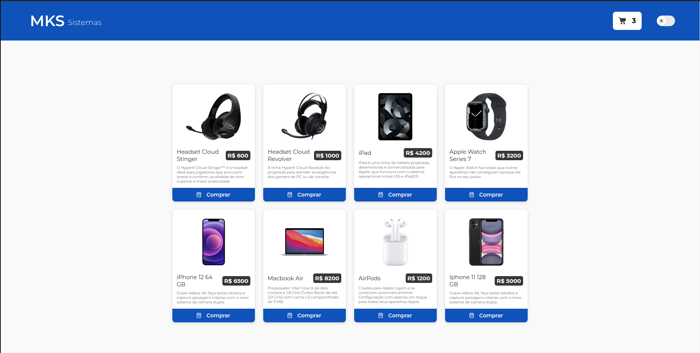
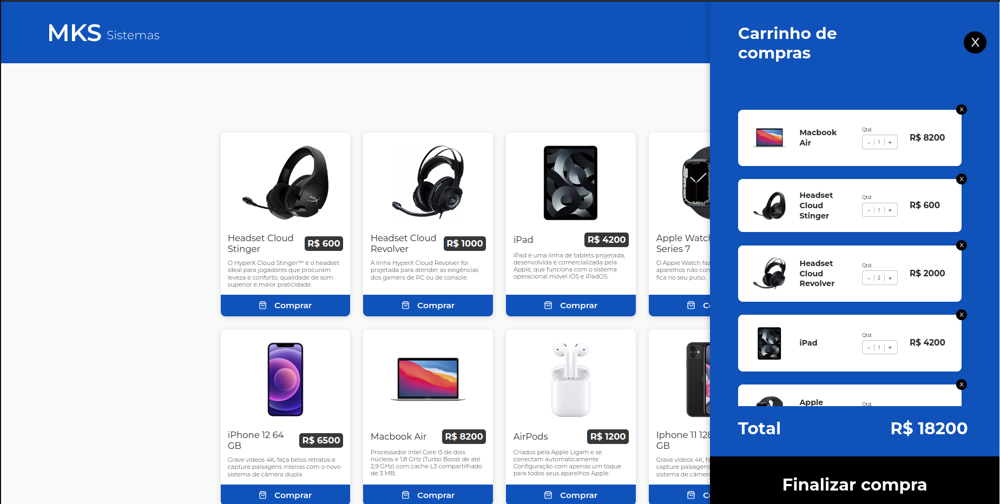
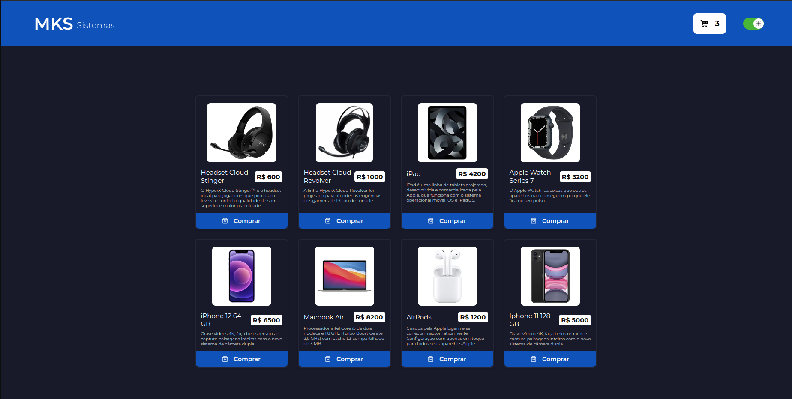
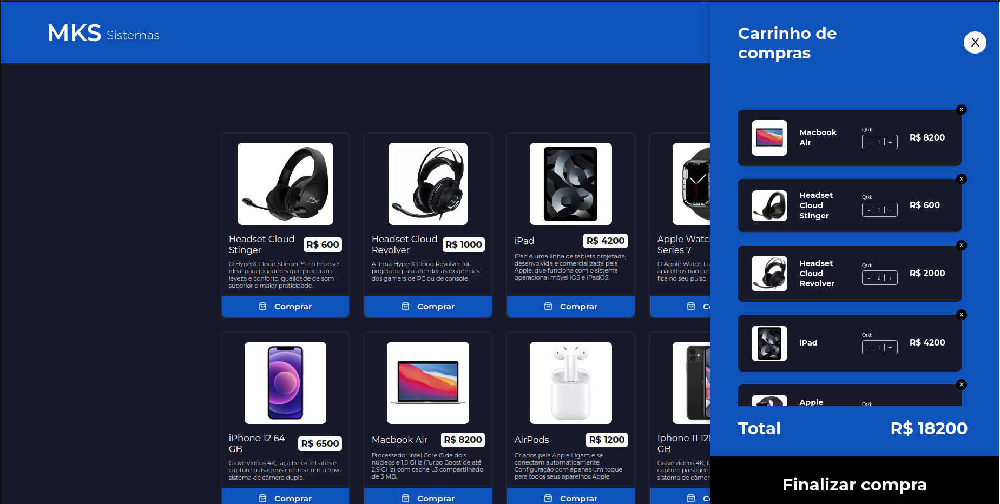
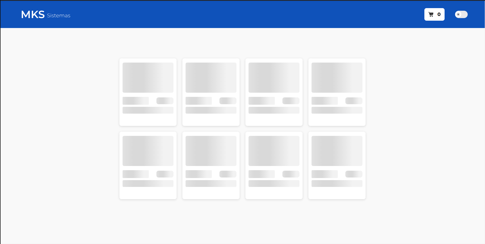

# Versão brasileira 🇧🇷

Projeto desenvolvido para o teste técnico da MKS

### Página Inicial

<div style="display: inline_block">
   
     
</div>

### Modo Noturno

<div style="display: inline_block">
   
     
</div>

### Animação de Carregamento

<div style="display: inline_block">
   
</div>

Disponível em: https://mks-front-end-challenge1.vercel.app/

## Sobre o Projeto

Projeto desenvolvido para o teste técnico de front-end da MKS

Abaixo segue a lista de algumas das funcionalidades implementadas:

- Conceitos de SSR (para otimizar a experiência do usuário que estiver utilizando o site, bem como mecanismos de busca- SEO) e CSR
- Redux para compartilhamento dos dados entre componentes
- React Query para gerenciamento de dados assíncronos e comunicação com API
- Cacheamento de dados
- Mudança de tema utilizando o ThemeProvider do Styled-Components
- Requisições com Axios
- Skeleton Loading
- Testes unitários utilizando a React Testing Library e Jest

## Tecnologias

Abaixo seguem as ferramentas e frameworks utilizados no projeto: <br/>

<div style="display: inline_block"> 
  
  
  
  
  
  
    
  
    
  
</div>


## Como Rodar

1. Clone este repositório
2. Adicione a URL da API nas variáveis de ambiente (exemplo no arquivo .env.example)
3. Instale as dependências
```bash
npm i
```
4. Rode a aplicação com
```bash
npm run dev
```
5. Você pode opcionalmente buildar o projeto 
```bash
npm run build
```
6. E executar a versão de produção
```bash
npm start
```
7. Por último, acesse http://localhost:3000 no seu navegador para vizualizar a aplicação

## Testes

Para rodar os testes execute o comando
```bash
npm test
```